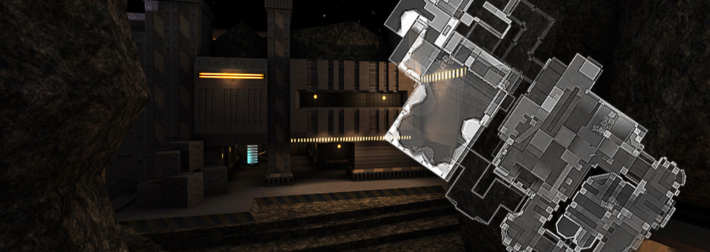
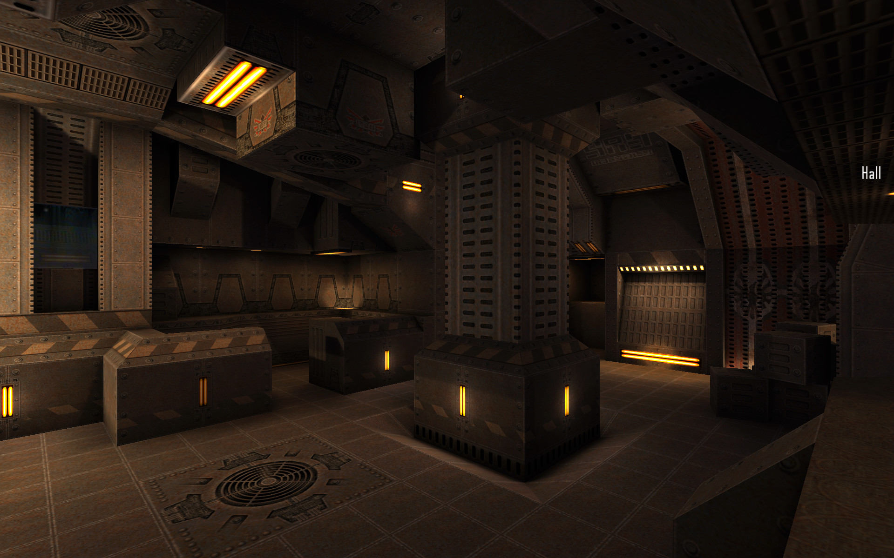
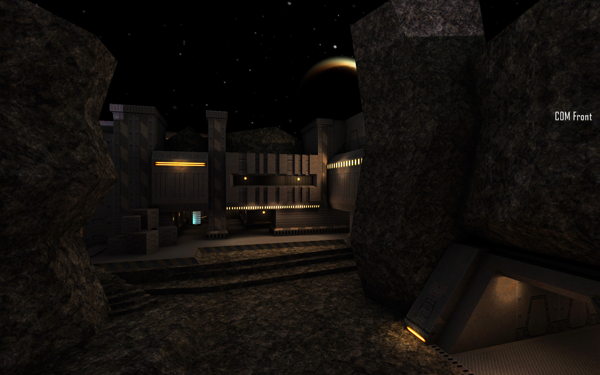
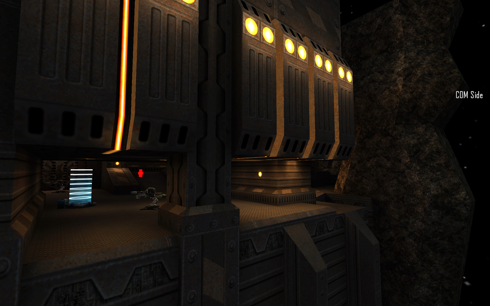
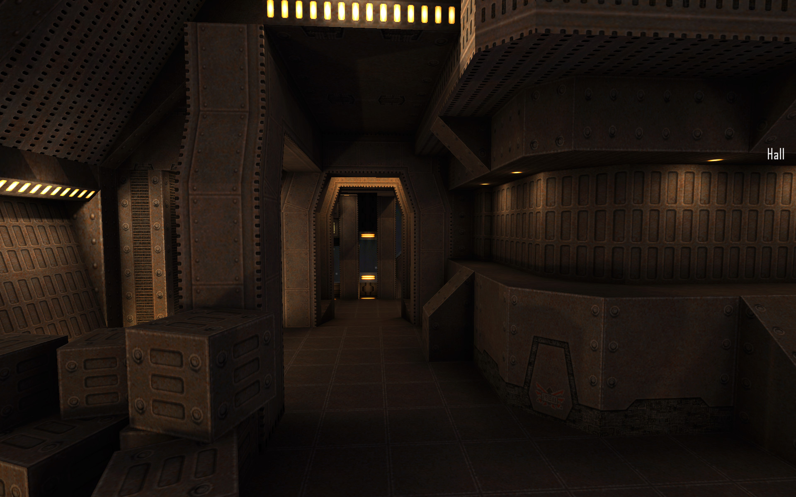
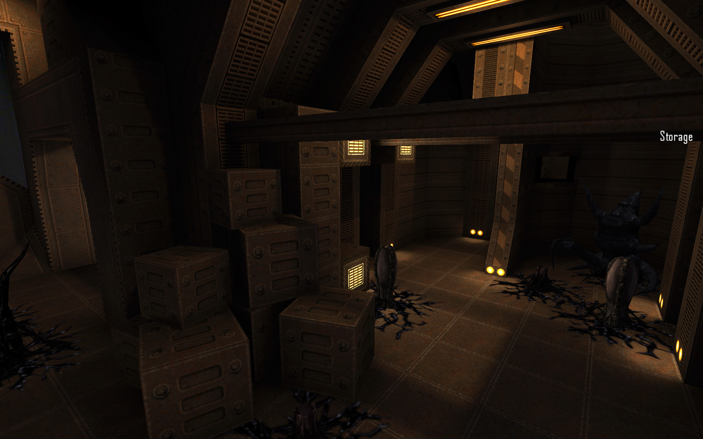
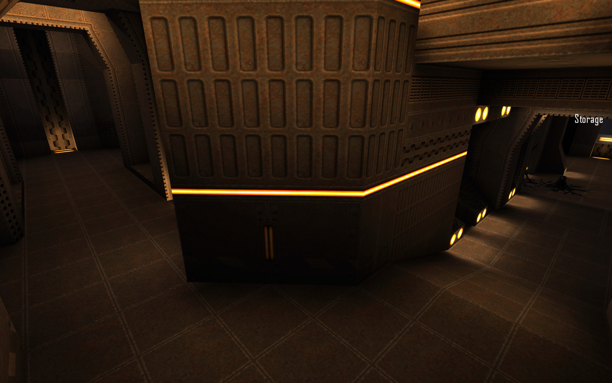
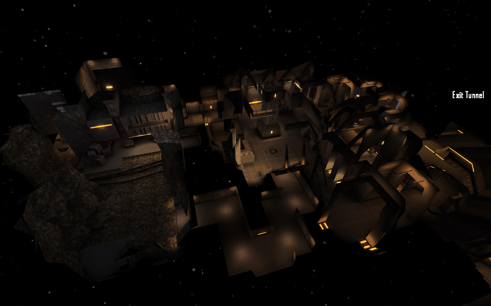

# Sol - Game Level For Tremulous
 

## Overview:

Sol is a game level by Matthias "Masmblr" Peters for the open source game [_Tremulous_](https://tremulous.net/).

Map Description: 
> Welcome to "Sol," a classic old-school Quake-like map. This fast crafted level offers an intense and action-packed experience in a relatively small setting.
> 
> The central hub of this map is a medium-sized hall, where all entrances converge, creating a nerve center for strategic maneuvers.
> 
> As you navigate through the level, you'll come across a storage room teeming with otherworldly creatures. Beware of their relentless attacks and cunning tactics as they defend their territory with unmatched ferocity.
> 
> On the opposing side, humans have fortified themselves in a communication station, desperately trying to coordinate their efforts and mount a resistance against the alien onslaught. 
> 
> The level design draws inspiration from the beloved  [Gloom Quake 2 Mod](http://www.planetgloom.com/gloom_gameplay_information.html), capturing its essence and atmosphere. The eQ2 Textures Pack enhances the visual experience, immersing you in a familiar yet fresh environment that pays homage to the old-school gaming era.
 
* * *

## Screenshots:
[](meta/preview_levelshots/1.jpg)
[](meta/preview_levelshots/2.jpg)
[](meta/preview_levelshots/3.jpg)
[](meta/preview_levelshots/4.jpg)
[](meta/preview_levelshots/5.jpg)
[](meta/preview_levelshots/6.jpg)
[](meta/preview_levelshots/7.jpg)
[](meta/preview_levelshots/8.jpg)
[](meta/preview_levelshots/9.jpg)

## Version History:
| Version: | Date:        | Status: |
| ------- | ------------- | ------: |
| 1.0     | 20/03/2017  | release |
## How-To
**Binary**:
1. Download the release package.
2. Save the *.pk3 file to the following directory: `/%PATH%/Tremulous/base/`.
3. Start the Tremulous game and select "Create Server" with the desired map.

**Source**:
1. Download the [source release](https://github.com/Masmblr/map-Sol_src/releases/) and the [tremulous-common-files](https://github.com/Masmblr/tremulous-map-common/releases/tag/v1.0).
2. Extract the files to the default installation directory. It should look like this:

```
DRIVE:/%PATH%/tremulous/
|   tremulous.exe
|   tremulous.x86
|   ...
+---base
|   |   autogen.cfg
|   |   data-1.1.0.pk3
|   |   map-atcs-1.1.0.pk3
|   |   ...
|   +---env
|   +---maps 
|   +---models 
|   +---scripts
|   +---sounds
|   \---textures
```
1. Download [NetRadiant Level Editor](https://netradiant.gitlab.io/page/download/).
2. Launch NetRadiant and select "Tremulous" as your game setting.
3. Open the '.map' file located in the directory `/%PATH%/tremulous/base/maps` and, from the menu, choose 'Build -> 'Build with final settings.'
4. Start the Tremulous game with `-sv_pure 0 -devmap MAPNAME`. Make sure to replace "MAPNAME" with the actual name of the map you compiled.

## Development Tools:
Photoshop CS6 \
[Audacity](https://www.audacityteam.org/) \
[NetRadiant](https://netradiant.gitlab.io/) \
[Q3Map2](http://q3map2.robotrenegade.com/)

## Related Resources:
Official Tremulous website: https://tremulous.net </br>
NET Radiant Level-Editor: https://netradiant.gitlab.io </br>
Master-Server-List: http://dpmaster.deathmask.net/?game=tremulous </br>
Unofficial successor "Unvanquished": https://unvanquished.net

## Legal Information and Attribution
Some assets may be derivative works or subject to different licenses. Please refer for author and license details. Note that some files may have been modified. Below is a list of files and their legal statuses.

***
env\sol\space1_bk.jpg <sup>[2](#Credit-2)</sup> \
env\sol\space1_dn.jpg <sup>[2](#Credit-2)</sup> \
env\sol\space1_ft.jpg <sup>[2](#Credit-2)</sup> \
env\sol\space1_lf.jpg <sup>[2](#Credit-2)</sup> \
env\sol\space1_rt.jpg <sup>[2](#Credit-2)</sup> \
env\sol\space1_up.jpg <sup>[2](#Credit-2)</sup> \
levelshots\sol.jpg <sup>[1](#Credit-1)</sup> \
maps\sol.map <sup>[1](#Credit-1)</sup> \
scripts\shaderlist.txt <sup>[1](#Credit-1)</sup> \
scripts\sol.arena <sup>[1](#Credit-1)</sup> \
scripts\sol.shader <sup>[1](#Credit-1)</sup> \
textures\sol\eq2_32cap.jpg <sup>[2](#Credit-2)</sup> \
textures\sol\eq2_32caplight.blend.jpg <sup>[2](#Credit-2)</sup> \
textures\sol\eq2_32caplight.jpg <sup>[2](#Credit-2)</sup> \
textures\sol\eq2_banner.png <sup>[2](#Credit-2)</sup> \
textures\sol\eq2_banner.tga <sup>[2](#Credit-2)</sup> \
textures\sol\eq2_banner_ow.png <sup>[2](#Credit-2)</sup> \
textures\sol\eq2_baselt.blend.jpg <sup>[2](#Credit-2)</sup> \
textures\sol\eq2_baselt.jpg <sup>[2](#Credit-2)</sup> \
textures\sol\eq2_baselt02.blend.jpg <sup>[2](#Credit-2)</sup> \
textures\sol\eq2_baselt02.jpg <sup>[2](#Credit-2)</sup> \
textures\sol\eq2_baselt03.blend.jpg <sup>[2](#Credit-2)</sup> \
textures\sol\eq2_baselt03.jpg <sup>[2](#Credit-2)</sup> \
textures\sol\eq2_baselt03b.blend.jpg <sup>[2](#Credit-2)</sup> \
textures\sol\eq2_baselt03b.jpg <sup>[2](#Credit-2)</sup> \
textures\sol\eq2_baselt04.blend.jpg <sup>[2](#Credit-2)</sup> \
textures\sol\eq2_baselt04.jpg <sup>[2](#Credit-2)</sup> \
textures\sol\eq2_bigmet_01.jpg <sup>[2](#Credit-2)</sup> \
textures\sol\eq2_bmtl.jpg <sup>[2](#Credit-2)</sup> \
textures\sol\eq2_bmtl2.jpg <sup>[2](#Credit-2)</sup> \
textures\sol\eq2_bmtl_01.jpg <sup>[2](#Credit-2)</sup> \
textures\sol\eq2_bmtl_02.jpg <sup>[2](#Credit-2)</sup> \
textures\sol\eq2_bmtl_02_384.jpg <sup>[2](#Credit-2)</sup> \
textures\sol\eq2_bmtl_02_384b.jpg <sup>[2](#Credit-2)</sup> \
textures\sol\eq2_bmtl_02up.jpg <sup>[2](#Credit-2)</sup> \
textures\sol\eq2_bmtl_03.jpg <sup>[2](#Credit-2)</sup> \
textures\sol\eq2_bmtl_03_light.blend.jpg <sup>[2](#Credit-2)</sup> \
textures\sol\eq2_bmtl_03_light.jpg <sup>[2](#Credit-2)</sup> \
textures\sol\eq2_bmtl_04.jpg <sup>[2](#Credit-2)</sup> \
textures\sol\eq2_bmtl_05.jpg <sup>[2](#Credit-2)</sup> \
textures\sol\eq2_bmtl_06.jpg <sup>[2](#Credit-2)</sup> \
textures\sol\eq2_bmtl_07.jpg <sup>[2](#Credit-2)</sup> \
textures\sol\eq2_bmtl_07b.jpg <sup>[2](#Credit-2)</sup> \
textures\sol\eq2_bmtl_08.jpg <sup>[2](#Credit-2)</sup> \
textures\sol\eq2_bmtl_08b.jpg <sup>[2](#Credit-2)</sup> \
textures\sol\eq2_bmtl_08c.jpg <sup>[2](#Credit-2)</sup> \
textures\sol\eq2_bounce.png <sup>[2](#Credit-2)</sup> \
textures\sol\eq2_bounce.tga <sup>[2](#Credit-2)</sup> \
textures\sol\eq2_bouncefan.png <sup>[2](#Credit-2)</sup> \
textures\sol\eq2_bouncefan.tga <sup>[2](#Credit-2)</sup> \
textures\sol\eq2_fbase.jpg <sup>[2](#Credit-2)</sup> \
textures\sol\eq2_fgrate_01.jpg <sup>[2](#Credit-2)</sup> \
textures\sol\eq2_fgrate_01.png <sup>[2](#Credit-2)</sup> \
textures\sol\eq2_fgrate_03.jpg <sup>[2](#Credit-2)</sup> \
textures\sol\eq2_fgrate_03.png <sup>[2](#Credit-2)</sup> \
textures\sol\eq2_fgrate_04.jpg <sup>[2](#Credit-2)</sup> \
textures\sol\eq2_fgrate_04.png <sup>[2](#Credit-2)</sup> \
textures\sol\eq2_floor_01.jpg <sup>[2](#Credit-2)</sup> \
textures\sol\eq2_floor_02.jpg <sup>[2](#Credit-2)</sup> \
textures\sol\eq2_floor_04.jpg <sup>[2](#Credit-2)</sup> \
textures\sol\eq2_floor_05.jpg <sup>[2](#Credit-2)</sup> \
textures\sol\eq2_floor_06.jpg <sup>[2](#Credit-2)</sup> \
textures\sol\eq2_floor_06b.jpg <sup>[2](#Credit-2)</sup> \
textures\sol\eq2_floor_07.jpg <sup>[2](#Credit-2)</sup> \
textures\sol\eq2_geodet.jpg <sup>[2](#Credit-2)</sup> \
textures\sol\eq2_grate_01.jpg <sup>[2](#Credit-2)</sup> \
textures\sol\eq2_grate_01.png <sup>[2](#Credit-2)</sup> \
textures\sol\eq2_mtl_01.jpg <sup>[2](#Credit-2)</sup> \
textures\sol\eq2_rock_01.jpg <sup>[2](#Credit-2)</sup> \
textures\sol\eq2_rock_02.jpg <sup>[2](#Credit-2)</sup> \
textures\sol\eq2_rock_03.jpg <sup>[2](#Credit-2)</sup> \
textures\sol\eq2_stepside_01.jpg <sup>[2](#Credit-2)</sup> \
textures\sol\eq2_stepsidelight.blend.jpg <sup>[2](#Credit-2)</sup> \
textures\sol\eq2_stepsidelight.jpg <sup>[2](#Credit-2)</sup> \
textures\sol\eq2_steptop01.jpg <sup>[2](#Credit-2)</sup> \
textures\sol\eq2_strogggrate.jpg <sup>[2](#Credit-2)</sup> \
textures\sol\eq2_telegoo.jpg <sup>[2](#Credit-2)</sup> \
textures\sol\eq2_telepanel.jpg <sup>[2](#Credit-2)</sup> \
textures\sol\eq2_telepanel.png <sup>[2](#Credit-2)</sup> \
textures\sol\eq2_telepanel.tga <sup>[2](#Credit-2)</sup> \
textures\sol\eq2_trim_01.jpg <sup>[2](#Credit-2)</sup> \
textures\sol\eq2_trim_01b.jpg <sup>[2](#Credit-2)</sup> \
textures\sol\eq2_trim_02.jpg <sup>[2](#Credit-2)</sup> \
textures\sol\eq2_trim_void.jpg <sup>[2](#Credit-2)</sup> \
textures\sol\eq2_trimh_01.jpg <sup>[2](#Credit-2)</sup> \
textures\sol\eq2_trimh_02.jpg <sup>[2](#Credit-2)</sup> \
textures\sol\eq2_trimh_03.jpg <sup>[2](#Credit-2)</sup> \
textures\sol\eq2_trimh_03b.jpg <sup>[2](#Credit-2)</sup> \
textures\sol\eq2_trimh_03c.jpg <sup>[2](#Credit-2)</sup> \
textures\sol\eq2_trimh_03cc.jpg <sup>[2](#Credit-2)</sup> \
textures\sol\eq2_trimh_03d.jpg <sup>[2](#Credit-2)</sup> \
textures\sol\eq2_trimh_03e.jpg <sup>[2](#Credit-2)</sup> \
textures\sol\eq2_trimlight_01.blend.jpg <sup>[2](#Credit-2)</sup> \
textures\sol\eq2_trimlight_01.jpg <sup>[2](#Credit-2)</sup> \
textures\sol\eq2_trimlight_01s.blend.jpg <sup>[2](#Credit-2)</sup> \
textures\sol\eq2_trimlight_01s.jpg <sup>[2](#Credit-2)</sup> \
textures\sol\eq2_trimlite_side.blend.jpg <sup>[2](#Credit-2)</sup> \
textures\sol\eq2_trimlite_side.jpg <sup>[2](#Credit-2)</sup> \
textures\sol\eq2_trimv_00.jpg <sup>[2](#Credit-2)</sup> \
textures\sol\eq2_trimv_01.jpg <sup>[2](#Credit-2)</sup> \
textures\sol\eq2_trimv_01b.jpg <sup>[2](#Credit-2)</sup> \
textures\sol\eq2_trimv_02.jpg <sup>[2](#Credit-2)</sup> \
textures\sol\eq2_trimv_03.jpg <sup>[2](#Credit-2)</sup> \
textures\sol\eq2_trimv_04.jpg <sup>[2](#Credit-2)</sup> \
textures\sol\eq2_trimv_04lite.blend.jpg <sup>[2](#Credit-2)</sup> \
textures\sol\eq2_trimv_04lite.jpg <sup>[2](#Credit-2)</sup> \
textures\sol\eq2_trimv_05.jpg <sup>[2](#Credit-2)</sup> \
textures\sol\eq2_trimv_05b.jpg <sup>[2](#Credit-2)</sup> \
textures\sol\eq2_trimv_06.jpg <sup>[2](#Credit-2)</sup> \
textures\sol\eq2_trimv_07.jpg <sup>[2](#Credit-2)</sup> \
textures\sol\eq2_trimv_08.jpg <sup>[2](#Credit-2)</sup> \
textures\sol\eq2_trimv_09.jpg <sup>[2](#Credit-2)</sup> \
textures\sol\eq2_trimv_09b.jpg <sup>[2](#Credit-2)</sup> \
textures\sol\eq2_trimv_10.jpg <sup>[2](#Credit-2)</sup> \
textures\sol\eq2_trimv_10b.jpg <sup>[2](#Credit-2)</sup> \
textures\sol\eq2_trimv_11.jpg <sup>[2](#Credit-2)</sup> \
textures\sol\eq2_trimv_11b.jpg <sup>[2](#Credit-2)</sup> \
textures\sol\eq2_trimv_11c.jpg <sup>[2](#Credit-2)</sup> \
textures\sol\eq2_trimv_11d.jpg <sup>[2](#Credit-2)</sup> \
textures\sol\eq2_trimv_12.jpg <sup>[2](#Credit-2)</sup> \
textures\sol\eq2_trimv_12b.jpg <sup>[2](#Credit-2)</sup> \
textures\sol\eq2_trimv_lite.blend.jpg <sup>[2](#Credit-2)</sup> \
textures\sol\eq2_trimv_lite.jpg <sup>[2](#Credit-2)</sup> \
textures\sol\eq2_trimv_mini.jpg <sup>[2](#Credit-2)</sup> \
textures\sol\eq2_trimv_mini02.jpg <sup>[2](#Credit-2)</sup> \
textures\sol\eq2_trimv_mini02b.jpg <sup>[2](#Credit-2)</sup> \
textures\sol\eq2_wallbig_01.blend.jpg <sup>[2](#Credit-2)</sup> \
textures\sol\eq2_wallbig_01.jpg <sup>[2](#Credit-2)</sup> \
textures\sol\eq2_wallbig_01b.jpg <sup>[2](#Credit-2)</sup> \
textures\sol\eq2_walllight_512.blend.jpg <sup>[2](#Credit-2)</sup> \
textures\sol\eq2_walllight_512.jpg <sup>[2](#Credit-2)</sup> \
textures\sol\eq2_weap_spawn.jpg <sup>[2](#Credit-2)</sup> \
textures\sol\eq2_weap_spawnlite.blend.jpg <sup>[1](#Credit-1)</sup> \
textures\sol\eq2_weap_spawnlite.jpg <sup>[2](#Credit-2)</sup> \
textures\sol\eq2_wire.jpg <sup>[2](#Credit-2)</sup> \
textures\sol\eq2_wires_01.png <sup>[2](#Credit-2)</sup> \
textures\sol\eq2_yell01.jpg <sup>[2](#Credit-2)</sup> \
textures\sol\eq2_yell02.jpg <sup>[2](#Credit-2)</sup> \
textures\sol\eq3_pillargrooves.jpg <sup>[2](#Credit-2)</sup>
***

### Credit-1

[Matthias "Masmblr" Peters](mailto:masmblr@gmail.com) \
Content: Map, Textures, Shaders \
License: [MIT License](https://opensource.org/license/mit/).
(See "LICENSE" file for more Informations.)

### Credit-2
[Yves Allaire](http://www.evillair.net/) \
Content: eQ2 Textures \
License: Attribution License

For all other content, their respective licensing rules and other legal provisions apply.

## Special Thanks:
* id Software for Quake3
* Dark Legion Development for Tremulous
* Team Xonotic for NetRadiant 
